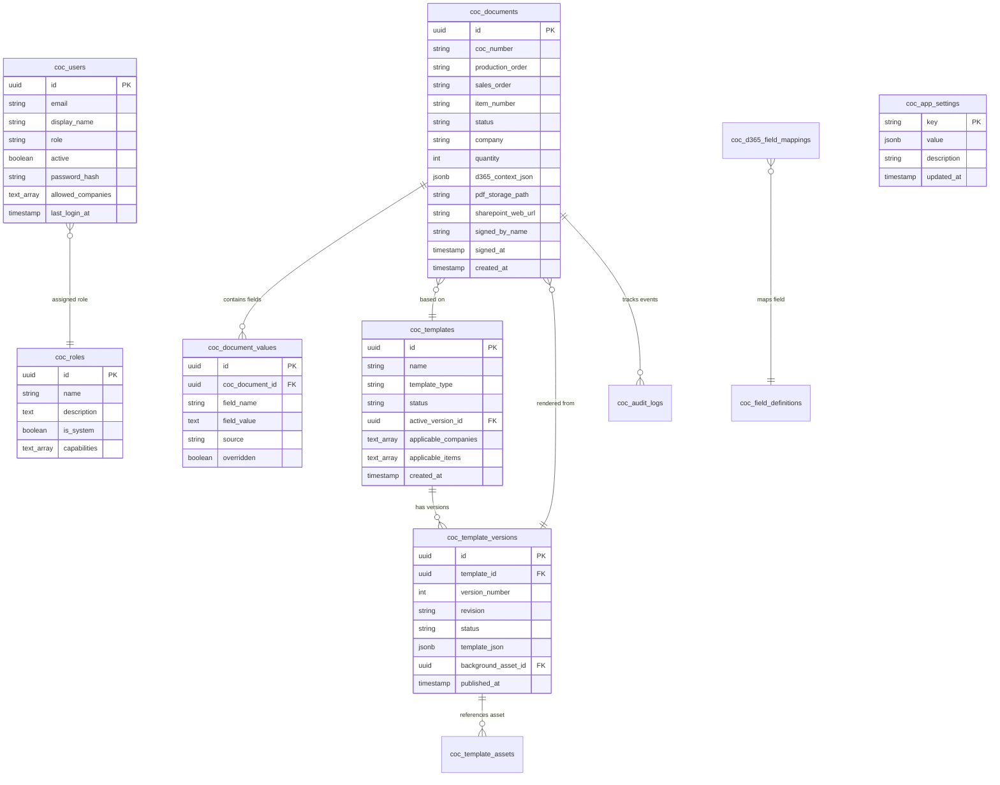
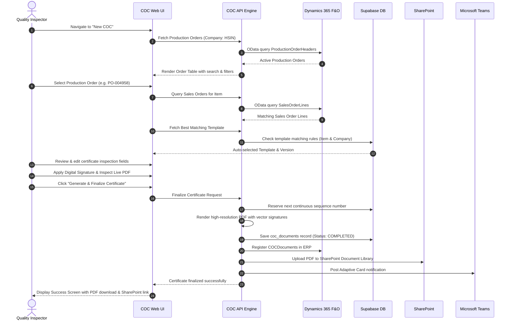
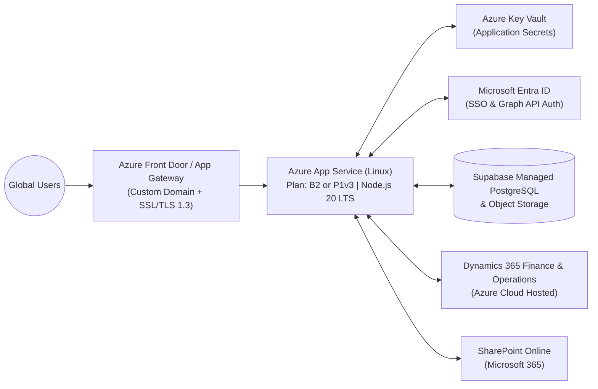

# HydraSpecma Certificate of Conformity (COC) Platform
## Comprehensive Architecture, Technical Data, User Guide & Azure Cloud Setup

---

## 1. Executive Summary & Purpose

The **HydraSpecma Certificate of Conformity (COC) Platform** is an enterprise web application designed for HydraSpecma manufacturing facilities (India, China, Denmark, Poland, Sweden, Finland, UK, USA, Brazil). 

The platform automates the generation, validation, digital signing, ERP synchronization, cloud archiving, and distribution of Certificates of Conformity (COC) for hydraulic hose assemblies, fittings, and engineering components supplied to global OEMs such as Vestas Wind Technology, Siemens Gamesa, and Caterpillar.

### Key Value Propositions
- **Eliminates Manual Certificate Creation**: Pulls live production orders, item numbers, batch numbers, serial numbers, customer drawing revisions, and sales order data directly from Microsoft Dynamics 365 Finance & Operations.
- **Continuous Product Number Sequencing**: Automatically tracks and increments official certificate sequence numbers per product/part number with configurable prefixes, zero-padding, and reset options.
- **Multi-Tenant Legal Entity Isolation**: Supports cross-company operations (HSIN, HGCN, HSDK, HSPL, etc.) with strict user company access controls.
- **Visual Drag-and-Drop Template Designer**: Allows quality engineers to customize certificate PDF layouts, dynamic data bindings, barcodes, and digital signature locations with zero code changes.
- **Enterprise Archival & Notification**: Uploads finalized, tamper-evident PDFs to Microsoft 365 SharePoint Document Libraries and automatically posts notifications to Microsoft Teams channels via Power Automate.

---

## 2. System Architecture

### 2.1 High-Level Architecture Diagram

```mermaid
flowchart TB
    subgraph Client["Client Tier (Browser)"]
        UI["Next.js 14 Web UI\n(Responsive Desktop / Tablet)"]
        Designer["Canvas Template Designer\n(Interactive WYSIWYG)"]
    end

    subgraph AppTier["Application Tier (Azure App Service / Node.js)"]
        NextServer["Next.js App Router Server"]
        AuthModule["Auth.js (NextAuth v5)\nEntra ID OIDC + Credentials"]
        PDFEngine["PDF Assembly Engine\n(pdf-lib / Canvas)"]
        CacheLayer["In-Memory LRU & TTL Caches\n(Tokens, DB Settings, Fields, Skeletons)"]
        Guard["Role & Capability Guard\n(RBAC Enforcement)"]
    end

    subgraph DataTier["Data & Storage Tier (Supabase)"]
        DB[("Supabase PostgreSQL\n(11 Core Tables, RLS, Foreign Keys)")]
        Bucket[("Supabase Storage\n(Background PDFs, Asset Badges)")]
    end

    subgraph External["Microsoft Cloud Ecosystem"]
        Entra["Microsoft Entra ID\n(SSO, Token Exchange)"]
        D365["Dynamics 365 F&O\n(OData REST APIs)"]
        SharePoint["SharePoint Online\n(Microsoft Graph REST API)"]
        Teams["Microsoft Teams\n(Power Automate Webhook)"]
    end

    UI -->|HTTPS / Next.js Server Actions| NextServer
    Designer -->|Template JSON / Asset Upload| NextServer
    NextServer --> Guard
    Guard --> AuthModule
    AuthModule <-->|OAuth 2.0 / OpenID Connect| Entra
    NextServer --> CacheLayer
    NextServer <-->|SQL Client (Parameterized)| DB
    NextServer <-->|S3 REST / Signed URLs| Bucket
    NextServer --> PDFEngine
    NextServer <-->|OData v4 / Bearer Token| D365
    NextServer <-->|Graph API v1.0 / Bearer Token| SharePoint
    NextServer -->|Adaptive Card Payload| Teams
```

### 2.2 Component Responsibilities

1. **Next.js 14 App Router**:
   - Unified full-stack framework serving both server-rendered React components and API route handlers.
   - Dynamic route streaming with immediate `<Suspense>` fallback skeletons (`src/app/(app)/loading.tsx`).
   - Prefetched sidebar navigation (`prefetch={true}`) enabling <16ms client-side page transitions.
2. **Auth.js (NextAuth v5)**:
   - Primary Enterprise SSO: Microsoft Entra ID (OpenID Connect / OAuth 2.0).
   - Secondary / Internal Fallback: Encrypted Credentials authentication with salted PBKDF2 password hashing.
   - Stateless, tamper-proof JSON Web Token (JWT) session cookies.
3. **Database Layer (Supabase PostgreSQL)**:
   - Houses templates, template versions, active fields, D365 mappings, user credentials, custom roles, audit logs, and certificate metadata.
   - Indexed on `production_order`, `sales_order`, `item_number`, `coc_document_id`, and `email` for sub-50ms queries.
4. **PDF Assembly Engine (`pdf-lib`)**:
   - Merges vector background template PDFs with dynamic text fields, tabular order data, company logos, and cryptographic digital signatures.
   - In-memory asset buffer caching prevents redundant re-downloads of multi-megabyte template backgrounds.
5. **Dynamics 365 Finance & Operations Integration**:
   - Server-to-server client-credentials OAuth grant against Azure AD.
   - Queries `ProductionOrderHeaders` and `SalesOrderLines` entities across company legal entities (`cross-company=true`).
   - Automatically registers finalized certificates into D365 document tables (`COCDocuments`).
6. **Microsoft SharePoint Storage (Microsoft Graph)**:
   - Archives signed certificate PDFs directly into designated SharePoint Document Libraries (e.g., `QualityAssurance/COC/{Year}/{Month}`).
7. **Microsoft Teams / Power Automate**:
   - Posts rich Adaptive Cards with certificate details, order numbers, signatory identity, and direct view links to company Teams channels.

---

## 3. Technical Specifications & Data Models

### 3.1 Technology Stack

| Layer | Technology / Package | Purpose |
| :--- | :--- | :--- |
| **Framework** | Next.js 14.2.x (App Router) | Server-side rendering, streaming, API routes |
| **Language** | TypeScript 5.x | Strict type safety across client and server |
| **Runtime** | Node.js 20.x LTS | Server execution environment |
| **Styling** | Tailwind CSS + Lucide React | HydraSpecma design system, responsive UI |
| **Database** | PostgreSQL 15+ (Supabase) | Relational data store, row-level security |
| **PDF Generation** | `pdf-lib` + `canvas` | Vector PDF manipulation and digital signature embedding |
| **Authentication** | `next-auth` v5 (Auth.js) | Microsoft Entra ID OIDC + Credentials |
| **ERP Protocol** | OData v4 / REST | Dynamics 365 Finance & Operations communication |
| **Cloud Storage** | Microsoft Graph API v1.0 | SharePoint Document Library synchronization |

### 3.2 Database Schema Architecture



### 3.3 Core Database Tables

1. **`coc_documents`**: The central record for every generated Certificate of Conformity.
   - Key columns: `id`, `coc_number`, `production_order`, `sales_order`, `item_number`, `batch_number`, `customer_account`, `customer_name`, `status` (`DRAFT`, `PENDING_SIGNATURE`, `COMPLETED`, `VOID`), `pdf_storage_path`, `sharepoint_web_url`, `signed_by_name`, `signed_at`.
2. **`coc_document_values`**: Key-value field entries for each certificate, recording whether values were auto-populated from D365 or manually overridden by an inspector.
3. **`coc_templates` & `coc_template_versions`**: Template metadata and JSON layouts defining dynamic field coordinates, font families, sizes, alignments, and background PDFs.
4. **`coc_field_definitions`**: Central dictionary of all available COC fields (e.g., `ItemNumber`, `BatchNumber`, `DrawingRevision`, `HydraulicPressureTest`, `HoseLength`).
5. **`coc_d365_field_mappings`**: Configurable rules mapping D365 OData entity properties to COC field definitions.
6. **`coc_app_settings`**: Global configuration key-value store for Azure Entra, D365 OData, SharePoint Graph, Teams Webhooks, and Number Sequences.
7. **`coc_users` & `coc_roles`**: User directory, password hashes, company access restrictions, and capability arrays.
8. **`coc_signatures`**: Pre-approved digital signatures of quality inspectors and managers.
9. **`coc_audit_logs`**: Immutable audit log recording all user actions, logins, certificate creations, overrides, downloads, and errors.

---

## 4. User Guide & Operational Workflows

### 4.1 Role Matrix & Capabilities

| Capability | Admin | Quality Inspector | Production | Viewer |
| :--- | :---: | :---: | :---: | :---: |
| **View Dashboard** | Yes | Yes | Yes | Yes |
| **Create COC Certificate** | Yes | Yes | Yes | No |
| **Sign Certificate Digitally** | Yes | Yes | No | No |
| **View / Download Completed COCs** | Yes | Yes | Yes | Yes |
| **Manage Templates & Designer** | Yes | Yes | No | No |
| **Manage Field Definitions** | Yes | No | No | No |
| **Manage D365 Mappings** | Yes | No | No | No |
| **Manage Users & Custom Roles** | Yes | No | No | No |
| **Manage Signatures** | Yes | Yes | No | No |
| **View Audit Trail** | Yes | No | No | No |
| **System Settings (Azure/D365/Teams)** | Yes | No | No | No |

---

### 4.2 Step-by-Step COC Generation Workflow



1. **Step 1: Production Order Selection**:
   - Filter by Legal Entity / Company (HSIN, HGCN, HSDK, etc.).
   - Search by Production Order Number, Item Number, Customer Name, or Customer PO.
   - Filter by status: *Started, Released, Reported Finished, Completed*.
   - Orders already fully certified are highlighted with an issuance badge.
2. **Step 2: Sales Order Enrichment**:
   - The platform auto-queries all sales orders matching the selected production item.
   - Select the target sales order line to inherit customer requisition, shipping destination, and customer part numbers.
3. **Step 3: Field Verification & Overrides**:
   - Inspect auto-populated parameters (Drawings, Revisions, Batch Numbers, Specifications).
   - Enter quality inspection measurements (e.g., test pressure, proof duration, crimp diameter).
   - Any overridden values are flagged in the audit log.
4. **Step 4: Digital Signature & Live Preview**:
   - Select an authorized stored signature or draw an instant digital signature on screen.
   - Instant visual PDF preview renders directly inside the browser in <50ms.
5. **Step 5: Multi-Channel Finalization**:
   - The platform generates the immutable PDF.
   - Number sequence is allocated (e.g., `HSIN-COC-2026-00042`).
   - D365 document entity is registered.
   - SharePoint library receives the PDF.
   - Microsoft Teams channel receives an instant notification with summary details.

---

## 5. Azure Cloud Setup & Deployment Guide

This section provides complete instructions for deploying the COC Platform to **Microsoft Azure**.

### 5.1 Recommended Azure Architecture



### 5.2 Prerequisites
1. **Azure Subscription** with permissions to create Resource Groups and App Services.
2. **Microsoft Entra ID (Azure AD)** tenant with Global Administrator or Application Administrator rights.
3. **Dynamics 365 Finance & Operations** environment URL (e.g., `https://hydraspecma.operations.dynamics.com`).
4. **Supabase Project** (Database URL and Service Role Key).

---

### 5.3 Step 1: Microsoft Entra ID App Registrations

Two App Registrations are recommended in Microsoft Entra ID:

#### App Registration 1: User Sign-In (SSO)
- **Name**: `HydraSpecma-COC-UserAuth`
- **Supported account types**: Single tenant (HydraSpecma tenant only).
- **Redirect URI**:
  - Platform: **Web**
  - Redirect URI: `https://<your-azure-app-name>.azurewebsites.net/api/auth/callback/microsoft-entra-id`
  - (Also add `http://localhost:3000/api/auth/callback/microsoft-entra-id` for local staging).
- **Certificates & Secrets**:
  - Generate a new Client Secret (save the `Value`).
- **API Permissions**:
  - `Microsoft Graph` -> Delegated permissions: `openid`, `profile`, `email`, `User.Read`.
  - Click **Grant admin consent for HydraSpecma**.

#### App Registration 2: Backend ERP & SharePoint Daemon
- **Name**: `HydraSpecma-COC-BackendIntegration`
- **Supported account types**: Single tenant.
- **Certificates & Secrets**: Generate a Client Secret.
- **API Permissions**:
  - **Microsoft Graph** -> Application permissions:
    - `Files.ReadWrite.All` (To upload PDFs to SharePoint).
    - `Sites.ReadWrite.All` (To access SharePoint Document Libraries).
  - **Dynamics ERP** (if querying D365 via OAuth daemon):
    - `Microsoft Dynamics ERP` -> Application permissions: `AX.FullAccess` or `OData` access.
  - Click **Grant admin consent**.
- **Configure in Dynamics 365 F&O**:
  - Go to **System administration → Setup → Microsoft Entra ID applications**.
  - Click **New**.
  - Enter Client ID of `HydraSpecma-COC-BackendIntegration`.
  - Name: `COC Platform Automation`.
  - User ID: Enter a dedicated service user (e.g., `Admin` or `COCServiceUser`).

---

### 5.4 Step 2: Create Azure App Service

1. Open **Azure Portal** (`portal.azure.com`).
2. Search for **App Services** → Click **Create** → **Web App**.
3. **Basics**:
   - **Resource Group**: `rg-hydraspecma-coc-prod`
   - **Name**: `coc-hydraspecma-india` (or your preferred unique name)
   - **Publish**: `Code`
   - **Runtime stack**: `Node 20 LTS`
   - **Operating System**: `Linux`
   - **Region**: `Central India` (or closest to factory/users)
   - **Pricing Plan**: `Basic B2` (Minimum recommended for production) or `Premium P1v3`.
4. Click **Review + create** → **Create**.

---

### 5.5 Step 3: Configure Environment Variables in Azure

In the Azure Portal, go to your Web App → **Settings** → **Environment variables** (or **Configuration**):

Add the following App Settings:

```ini
# Application Identity
APP_NAME=HydraSpecma COC Platform
APP_URL=https://coc-hydraspecma-india.azurewebsites.net
NODE_ENV=production
PORT=3000

# NextAuth v5 Configuration
AUTH_SECRET=<Generate a 32-byte string using: openssl rand -base64 32>
AUTH_TRUST_HOST=true
AUTH_MICROSOFT_ENTRA_ID_ID=<Client ID of HydraSpecma-COC-UserAuth>
AUTH_MICROSOFT_ENTRA_ID_SECRET=<Client Secret of HydraSpecma-COC-UserAuth>
AUTH_MICROSOFT_ENTRA_ID_ISSUER=https://login.microsoftonline.com/<YOUR_TENANT_ID>/v2.0
ADMIN_EMAILS=manigandan.parthasarathi@hydraspecma.com
AUTH_DEV_BYPASS=false

# Supabase Storage & Database
SUPABASE_URL=https://<your-project-ref>.supabase.co
SUPABASE_ANON_KEY=<your-supabase-anon-key>
SUPABASE_SERVICE_ROLE_KEY=<your-supabase-service-role-key>

# Dynamics 365 Finance & Operations
D365_MODE=live
D365_BASE_URL=https://<your-env>.operations.dynamics.com
D365_TENANT_ID=<YOUR_TENANT_ID>
D365_CLIENT_ID=<Client ID of Backend Integration App>
D365_CLIENT_SECRET=<Client Secret of Backend Integration App>
D365_COMPANY=hsin
D365_PRODUCTION_ENTITY=ProductionOrderHeaders
D365_COC_ENTITY=COCDocuments
D365_SALES_ORDER_ENTITY=SalesOrderLines

# SharePoint Archiving
STORAGE_MODE=live
AZURE_TENANT_ID=<YOUR_TENANT_ID>
AZURE_CLIENT_ID=<Client ID of Backend Integration App>
AZURE_CLIENT_SECRET=<Client Secret of Backend Integration App>
SHAREPOINT_SITE_ID=<Your SharePoint Site ID>
SHAREPOINT_DRIVE_ID=<Your SharePoint Document Library Drive ID>
SHAREPOINT_ROOT_FOLDER=COC

# Security & Operations
AUTOMATION_API_KEY=<Long random 64-character token>
LOG_LEVEL=info
```

### 5.6 Step 4: Configure App Service Startup Command

In Azure App Service:
1. Go to **Settings** → **Configuration** → **General settings**.
2. Set **Startup Command**:
   ```bash
   node server.js
   ```
   *(Or for standard Next.js npm runner)*:
   ```bash
   npm run start
   ```
3. Enable **Always On**: `On`
4. Set **HTTP Version**: `2.0`
5. Click **Save**.

---

### 5.7 Step 5: Deploying the Application via Zip / GitHub Actions

#### Method A: Deploying with the Provided Zip File (`coc azure.zip`)

You can deploy directly using Azure CLI:

```bash
az webapp deploy \
  --resource-group rg-hydraspecma-coc-prod \
  --name coc-hydraspecma-india \
  --src-path "coc azure.zip" \
  --type zip
```

#### Method B: GitHub Actions Automated CI/CD Pipeline

Create `.github/workflows/azure-deploy.yml`:

```yaml
name: Deploy COC Platform to Azure App Service

on:
  push:
    branches: [ main ]

jobs:
  build-and-deploy:
    runs-on: ubuntu-latest
    steps:
      - uses: actions/checkout@v4

      - name: Setup Node.js 20
        uses: actions/setup-node@v4
        with:
          node-version: 20
          cache: 'npm'

      - name: Install Dependencies
        run: npm ci

      - name: Build Next.js Application
        run: npm run build
        env:
          NEXT_TELEMETRY_DISABLED: 1

      - name: Deploy to Azure Web App
        uses: azure/webapps-deploy@v3
        with:
          app-name: 'coc-hydraspecma-india'
          publish-profile: ${{ secrets.AZURE_WEBAPP_PUBLISH_PROFILE }}
          package: .
```

---

## 6. Current App Setup & Security Architecture

### 6.1 Security Principles & Data Protection

1. **Authentication & Identity Defense**:
   - **Microsoft Entra ID (OIDC)**: All corporate employees authenticate through HydraSpecma's Microsoft 365 tenant with MFA (Multi-Factor Authentication).
   - **Credentials Engine**: Internal accounts are hashed using **PBKDF2 with SHA-512 and 100,000 iterations**, with individual cryptographic salt per user. Plain text passwords are never written to disk or logs.
   - **Session Security**: Session tokens are stored in `HttpOnly`, `SameSite=Lax`, `Secure` cookies, preventing cross-site scripting (XSS) extraction.
2. **Access Control (RBAC)**:
   - Every API route and page enforces granular capability checks (`requireCapability("createCoc")`, `requireCapability("manageUsers")`, etc.).
   - Users cannot elevate roles or modify configuration without the `manageSettings` capability.
3. **Database Security**:
   - The Supabase Service Role Key is strictly **server-only** and never exported to client JavaScript bundles.
   - All SQL operations utilize parameterized queries, completely eliminating SQL injection vectors.
4. **Network & Integration Hardening**:
   - External OAuth tokens for Dynamics 365 and Microsoft Graph are cached in volatile server memory with safety buffers and are never returned to client browsers.
   - Incoming webhooks and Power Automate APIs require the `X-Api-Key` automation token.
5. **Comprehensive Audit Trail**:
   - Every action (signing, override, template edit, configuration change, user deletion) logs an immutable record in `coc_audit_logs` capturing user ID, user email, timestamp, IP address, and payload delta.

---

## 7. Operational Maintenance & Health Monitoring

### Health Endpoint
- The platform provides an automated health probe at:
  ```http
  GET /api/health
  ```
- Returns HTTP 200 with uptime, database status, and environment readiness.

### In-Memory Cache Management
- If credentials or settings are updated in **Admin → System Settings**, the platform automatically purges in-memory caches.
- To programmatically flush caches, invoke:
  ```typescript
  D365Service.clearCaches();
  invalidateConfigCache();
  invalidateFieldsCache();
  invalidateRolesCache();
  ```

---
*Documentation compiled for HydraSpecma Quality Assurance & Enterprise Systems Engineering.*
