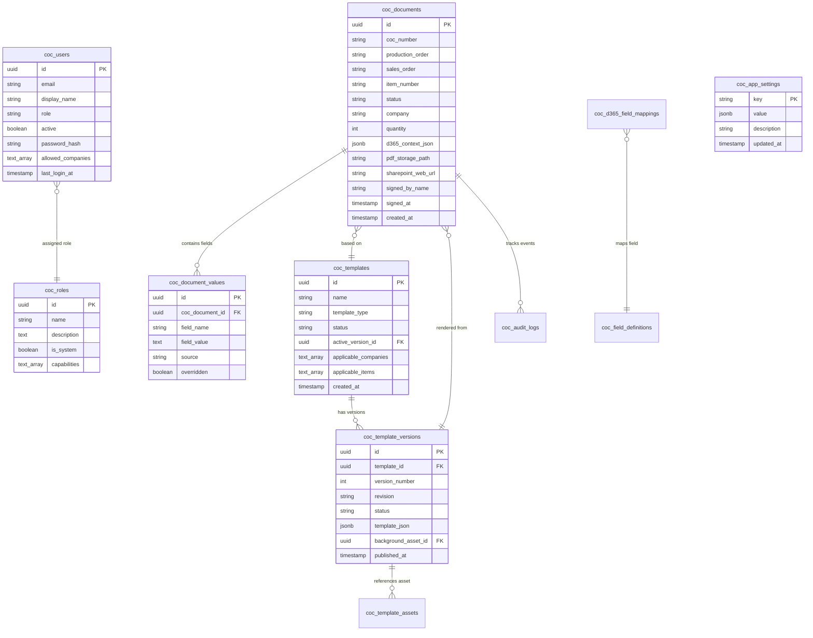

# HydraSpecma Certificate of Conformity (COC) Platform
# Master Documentation & Universal Technical Reference Manual

> **Document Version**: 2.1.0  
> **Target Audience**: Quality Engineers, System Administrators, Cloud Architects, Software Engineers, and Operations Teams  
> **Scope**: Architecture, Database, APIs, Template Designer, ERP (D365), SharePoint, Azure Cloud Setup, Security & Operational Runbooks  

---

## Master Table of Contents

1. [Documentation Catalog & Document Index](#1-documentation-catalog--document-index)
2. [Platform Overview & Executive Summary](#2-platform-overview--executive-summary)
3. [End-to-End System Architecture](#3-end-to-end-system-architecture)
4. [Database Schema & Data Models](#4-database-schema--data-models)
5. [Template Engine & Visual Designer Schema](#5-template-engine--visual-designer-schema)
6. [Complete REST API Reference](#6-complete-rest-api-reference)
7. [Microsoft SharePoint Integration Guide](#7-microsoft-sharepoint-integration-guide)
8. [Microsoft Dynamics 365 F&O Integration Guide](#8-microsoft-dynamics-365-fo-integration-guide)
9. [Azure Cloud Setup & Deployment Manual](#9-azure-cloud-setup--deployment-manual)
10. [Application Security & Compliance Architecture](#10-application-security--compliance-architecture)
11. [User Guide & Operational Workflows](#11-user-guide--operational-workflows)
12. [Operational Runbook & Quick-Reference Cheatsheet](#12-operational-runbook--quick-reference-cheatsheet)

---

## 1. Documentation Catalog & Document Index

Below is the directory map of all individual specification documents in the repository and how they relate to this Master Manual:

| Document Path | Document Title | Primary Scope |
| :--- | :--- | :--- |
| [`docs/01-ARCHITECTURE.md`](file:///C:/Projects/coc/coc-platform-phase1/coc-platform/docs/01-ARCHITECTURE.md) | **System Architecture & Context** | High-level system context, data ownership rules, rendering pipeline, storage strategy, and failure handling. |
| [`docs/02-DATABASE.md`](file:///C:/Projects/coc/coc-platform-phase1/coc-platform/docs/02-DATABASE.md) | **Database Schema & SQL Spec** | Complete PostgreSQL tables, column definitions, data types, indexes, and Supabase RLS policies. |
| [`docs/03-TEMPLATE-SCHEMA.md`](file:///C:/Projects/coc/coc-platform-phase1/coc-platform/docs/03-TEMPLATE-SCHEMA.md) | **Template JSON Schema** | Specification for canvas elements, DPI coordinates, data-binding paths, conditional text, and barcodes. |
| [`docs/04-API.md`](file:///C:/Projects/coc/coc-platform-phase1/coc-platform/docs/04-API.md) | **REST API Specifications** | All server routes under `/api/*`, required roles, request validation schemas, and error envelopes. |
| [`docs/05-SHAREPOINT-SETUP.md`](file:///C:/Projects/coc/coc-platform-phase1/coc-platform/docs/05-SHAREPOINT-SETUP.md) | **SharePoint & Graph API Setup** | Azure AD app registration, Graph permissions, Site/Drive discovery, and automated PDF archiving. |
| [`docs/06-D365FO-SETUP.md`](file:///C:/Projects/coc/coc-platform-phase1/coc-platform/docs/06-D365FO-SETUP.md) | **Dynamics 365 F&O Integration** | OData v4 configuration, client-credentials OAuth, custom ERP entities, and cross-company queries. |
| [`docs/AZURE_ARCHITECTURE_AND_SETUP_GUIDE.md`](file:///C:/Projects/coc/coc-platform-phase1/coc-platform/docs/AZURE_ARCHITECTURE_AND_SETUP_GUIDE.md) | **Azure Cloud Setup & Security** | Step-by-step Azure App Service setup, Entra ID SSO, environment variables, and security hardening. |
| [`README.md`](file:///C:/Projects/coc/coc-platform-phase1/coc-platform/README.md) | **Developer Quick Start** | Local development guide, scripts, commands, and repository structure. |

---

## 2. Platform Overview & Executive Summary

The **HydraSpecma Certificate of Conformity (COC) Platform** is an enterprise-grade manufacturing quality system built for HydraSpecma's global factories (India, China, Denmark, Poland, Sweden, Finland, UK, USA, and Brazil).

### Core Problem Solved
Historically, quality engineers manually drafted inspection certificates by copying order details from ERP screens into Word or Excel templates, manually typing batch and serial numbers, printing paper copies for wet signatures, scanning PDFs, and manually filing them into network shares.

### Solution Capabilities
- **Automated ERP Pull**: Ingests production orders, sales lines, drawing revisions, batch IDs, and customer PO numbers directly from Microsoft Dynamics 365 Finance & Operations via OData.
- **Continuous Product-Based Number Sequences**: Automatically generates and increments official certificate numbers with configurable prefixes, zero-padding, and reset options.
- **Multi-Tenant Legal Entity Isolation**: Enables quality teams to manage certificates across different legal entities (`HSIN`, `HGCN`, `HSDK`, `HSPL`, etc.) with user access controls.
- **Interactive Visual Designer**: Drag-and-drop WYSIWYG canvas to create, version, and publish certificate templates with live field bindings.
- **Dual Cloud Archiving & Alerts**: Saves immutable, cryptographically signed PDFs into Microsoft 365 SharePoint Document Libraries and sends Adaptive Cards to Microsoft Teams channels.

---

## 3. End-to-End System Architecture

### 3.1 Architecture Overview

```mermaid
flowchart TB
    subgraph Client["Client Tier (Browser)"]
        UI["Next.js 14 Web UI\n(Responsive Desktop / Tablet)"]
        Designer["Canvas Template Designer\n(Interactive WYSIWYG)"]
    end

    subgraph AppTier["Application Tier (Azure App Service / Node.js 20)"]
        NextServer["Next.js App Router Server"]
        AuthModule["Auth.js (NextAuth v5)\nEntra ID OIDC + Credentials"]
        PDFEngine["PDF Assembly Engine\n(pdf-lib / Canvas)"]
        CacheLayer["In-Memory LRU & TTL Caches\n(Tokens, DB Settings, Fields, Skeletons)"]
        Guard["Role & Capability Guard\n(RBAC Enforcement)"]
    end

    subgraph DataTier["Data & Storage Tier (Supabase)"]
        DB[("Supabase PostgreSQL\n(11 Core Tables, RLS, Foreign Keys)")]
        Bucket[("Supabase Storage\n(Background PDFs, Asset Badges)")]
    end

    subgraph External["Microsoft Cloud Ecosystem"]
        Entra["Microsoft Entra ID\n(SSO, Token Exchange)"]
        D365["Dynamics 365 F&O\n(OData REST APIs)"]
        SharePoint["SharePoint Online\n(Microsoft Graph REST API)"]
        Teams["Microsoft Teams\n(Power Automate Webhook)"]
    end

    UI -->|HTTPS / Next.js Server Actions| NextServer
    Designer -->|Template JSON / Asset Upload| NextServer
    NextServer --> Guard
    Guard --> AuthModule
    AuthModule <-->|OAuth 2.0 / OpenID Connect| Entra
    NextServer --> CacheLayer
    NextServer <-->|SQL Client (Parameterized)| DB
    NextServer <-->|S3 REST / Signed URLs| Bucket
    NextServer --> PDFEngine
    NextServer <-->|OData v4 / Bearer Token| D365
    NextServer <-->|Graph API v1.0 / Bearer Token| SharePoint
    NextServer -->|Adaptive Card Payload| Teams
```

### 3.2 Rules of Data Ownership

| Domain | Authoritative System | Architecture Policy |
| :--- | :--- | :--- |
| **Production Orders & Sales Orders** | **Dynamics 365 F&O** | Read dynamically via OData with 30s–45s in-memory LRU caching. Never duplicated as master records. |
| **Official COC Records** | **Dynamics 365 F&O + Supabase** | D365 `COCDocuments` entity is the ERP system of record; mirrored in Supabase `coc_documents` for operational indexing and fast queries. |
| **Archival PDFs** | **SharePoint Online** | SharePoint Document Library is the permanent regulatory archive; Supabase Storage retains a secure copy. |
| **Templates, Fields & Settings** | **Supabase PostgreSQL** | Authoritative store for layout schemas, field dictionaries, custom roles, and app configuration. |
| **User Identity** | **Microsoft Entra ID** | Corporate users authenticate via Entra ID; internal accounts use PBKDF2 hashed credentials in Supabase. |

---

## 4. Database Schema & Data Models

The database comprises 11 core tables in PostgreSQL:



### Table Dictionary
1. **`coc_documents`**: Stores each generated certificate with status (`DRAFT`, `COMPLETED`, `VOID`), order metadata, digital signature, and cloud URLs.
2. **`coc_document_values`**: Key-value data points for certificates, recording source (`d365`, `manual`, `system`) and override flags.
3. **`coc_templates`**: Certificate types (e.g., Standard HydraSpecma A4 Certificate) with target companies and items.
4. **`coc_template_versions`**: Immutable published layouts alongside mutable working drafts.
5. **`coc_template_assets`**: Background vector PDFs and images uploaded for certificate backgrounds.
6. **`coc_field_definitions`**: Central dictionary of available inspection and ERP fields with validation rules.
7. **`coc_d365_field_mappings`**: Mapping definitions between D365 OData properties and COC fields.
8. **`coc_app_settings`**: Global key-value store for Azure, D365, SharePoint, Teams, and Number Sequences.
9. **`coc_users`**: User records with salted PBKDF2 password hashes and allowed company restrictions.
10. **`coc_roles`**: System roles (`Admin`, `Quality Inspector`, `Production`, `Viewer`) and custom roles with fine-grained capabilities.
11. **`coc_signatures`**: Authorized digital signature assets.
12. **`coc_audit_logs`**: Chronological, immutable compliance log of all system actions.

---

## 5. Template Engine & Visual Designer Schema

Templates define page layout, vector geometry, font rendering, and dynamic data bindings in a declarative JSON format (`template_json`).

### 5.1 Coordinate System & Geometry
- **Standard**: Standard A4 (`595.28` × `841.89` pt) or Letter (`612` × `792` pt).
- **Origin**: Top-left corner `(0, 0)`.
- **Units**: Standard typographic points (1 pt = 1/72 inch).

### 5.2 Supported Element Types
- **`text`**: Dynamic or static text with font family (`Helvetica`, `Times`, `Courier`), size, color, alignment, and formatting pipes.
- **`barcode`**: Code128, Code39, or QR Code generated vectorially from field values.
- **`image`**: Logos, certification marks, and inspector digital signatures.
- **`table`**: Tabular repeating line items (e.g., multi-line sales order releases, component lists).
- **`line` & `rect`**: Vector separator rules, borders, and colored header backgrounds.

### 5.3 Data Binding Expressions
Fields use source-based bindings resolved at runtime:
```json
{
  "type": "text",
  "binding": "ItemNumber",
  "source": "d365",
  "x": 140,
  "y": 210,
  "fontSize": 10,
  "fontFamily": "Helvetica-Bold"
}
```

---

## 6. Complete REST API Reference

All routes are implemented under `src/app/api/*`. Every protected endpoint validates session tokens and enforces role-based capability checks.

### 6.1 Authentication & Session
- `ALL /api/auth/[...nextauth]` — Auth.js Microsoft Entra ID OIDC handler.
- `GET /api/me` — Returns current authenticated user, role, and capabilities.
- `GET /api/health` — System health check, database status, and mode flags.

### 6.2 Documents & Certificates
- `GET /api/coc` — List generated COCs with pagination, search, and date filters.
- `POST /api/coc` — Create a new draft certificate.
- `GET /api/coc/:id` — Retrieve certificate metadata and populated field values.
- `GET /api/coc/:id/pdf` — Stream finalized PDF with caching headers.
- `POST /api/coc/preview` — Generate ephemeral PDF preview without creating a database record (<50ms).
- `GET /api/coc/by-po?po=:po` — Fast-path query for all COCs issued against a production order.
- `POST /api/coc/:id/retry` — Retry failed D365 or SharePoint sync.
- `POST /api/coc/:id/send-teams` — Trigger manual Microsoft Teams notification.

### 6.3 Dynamics 365 F&O Integration
- `GET /api/d365/companies` — Retrieve legal entities (HSIN, HGCN, HSDK, etc.).
- `GET /api/d365/production-orders?q=&company=&status=` — Query D365 production orders.
- `GET /api/d365/production-orders/:id` — Retrieve full production order header and quantity details.
- `GET /api/d365/sales-orders?itemNumber=&company=&salesOrder=` — Query sales orders for an item.

### 6.4 Templates & Designer
- `GET /api/templates` — List templates with active version summaries.
- `POST /api/templates` — Create a new template.
- `GET /api/templates/:id` — Get template with version history.
- `POST /api/templates/from-pdf` — Create and publish a template directly from an uploaded PDF.
- `POST /api/templates/ensure-draft` — Ensure an editable draft version exists for the designer.
- `PUT /api/templates/:id/versions/:versionId` — Save modified template JSON layout.
- `POST /api/templates/:id/versions/:versionId/publish` — Publish draft layout to production.

### 6.5 Administration & Settings
- `GET /api/fields` — List active field definitions.
- `POST /api/fields` — Create a custom field definition.
- `GET /api/d365-mappings` — List D365-to-field mapping rules.
- `PUT /api/admin/config` — Save application settings (Azure, D365, SharePoint, Teams).
- `POST /api/admin/config/test` — Live integration test for D365, SharePoint, or Teams.
- `GET /api/admin/number-sequences/rule?itemNumber=` — Query continuous sequence rule for product.
- `GET /api/users` & `POST /api/users` — Manage user accounts and company restrictions.
- `GET /api/roles` & `POST /api/roles` — Manage custom security roles and capabilities.
- `GET /api/signatures` & `POST /api/signatures` — Manage stored digital signatures.
- `GET /api/audit` — Query audit trail entries.

---

## 7. Microsoft SharePoint Integration Guide

### 7.1 Architecture & Flow
Signed certificates are uploaded to SharePoint Online using the **Microsoft Graph API v1.0** via the OAuth 2.0 client-credentials grant.

### 7.2 Directory Organization
```
SharePoint Document Library (e.g. QualityAssurance)
└── COC/
    └── {CompanyCode}/         (e.g., HSIN, HGCN)
        └── {Year}/            (e.g., 2026)
            └── {Month}/       (e.g., 09)
                └── {COC_Number}_{ItemNumber}.pdf
```

### 7.3 Graph API Setup Steps
1. **Azure Portal → Entra ID → App Registrations** → Create `HydraSpecma-COC-BackendIntegration`.
2. Under **API permissions** → Add **Microsoft Graph** → **Application permissions**:
   - `Files.ReadWrite.All`
   - `Sites.ReadWrite.All`
3. Click **Grant admin consent**.
4. Retrieve **Site ID** and **Drive ID** via Microsoft Graph Explorer:
   ```http
   GET https://graph.microsoft.com/v1.0/sites/{hostname}:/sites/{site-name}
   GET https://graph.microsoft.com/v1.0/sites/{site-id}/drives
   ```
5. Enter `SHAREPOINT_SITE_ID`, `SHAREPOINT_DRIVE_ID`, and `SHAREPOINT_ROOT_FOLDER` in **Admin → System Settings**.
6. Click **Test SharePoint Connection** in the platform UI to verify.

---

## 8. Microsoft Dynamics 365 F&O Integration Guide

### 8.1 Architecture & Flow
The platform communicates directly with Dynamics 365 Finance & Operations via **OData v4 REST endpoints** using client-credentials authentication against Microsoft Entra ID.

### 8.2 D365 F&O Setup Steps
1. **Azure AD App Registration**:
   - Create `HydraSpecma-COC-BackendIntegration` in the same Azure tenant as D365.
   - Note the **Application (Client) ID** and generate a **Client Secret**.
2. **Configure in D365 Finance & Operations**:
   - Navigate to **System administration → Setup → Microsoft Entra ID applications**.
   - Click **New**.
   - **Client ID**: Paste the Azure Application (Client) ID.
   - **Name**: `COC Platform Integration`.
   - **User ID**: Select a service account with appropriate security roles (e.g., `Admin` or custom quality role).
3. **Configure in COC Platform**:
   - Enter D365 Base URL (e.g., `https://hydraspecma.operations.dynamics.com`), Tenant ID, Client ID, and Client Secret in **Admin → System Settings**.
   - Click **Test Dynamics 365 Connection** in the platform UI to verify.

---

## 9. Azure Cloud Setup & Deployment Manual

### 9.1 Azure Resources Required
- **Azure App Service**: Linux Plan (`B2` or `P1v3`), Node.js 20 LTS.
- **Microsoft Entra ID**: Single tenant app registrations for User SSO and Backend integrations.
- **Supabase PostgreSQL**: Database and storage instance.

### 9.2 Step-by-Step App Service Deployment
1. Create a Linux Web App in the **Azure Portal** with runtime `Node 20 LTS`.
2. Under **Configuration → General settings**:
   - **Startup Command**: `npm run start`
   - **Always On**: `On`
   - **HTTP Version**: `2.0`
3. Configure all environment variables in **Configuration → Application settings** (see table below).
4. Deploy the deployment package `coc azure.zip` using the Azure CLI:
   ```bash
   az webapp deploy \
     --resource-group rg-hydraspecma-coc-prod \
     --name coc-hydraspecma-india \
     --src-path "coc azure.zip" \
     --type zip
   ```

### 9.3 Environment Variables Reference

| Variable | Description | Example / Value |
| :--- | :--- | :--- |
| `APP_NAME` | Display name of the platform | `HydraSpecma COC Platform` |
| `APP_URL` | Fully qualified public URL | `https://coc-hydraspecma.azurewebsites.net` |
| `NODE_ENV` | Runtime environment | `production` |
| `AUTH_SECRET` | 32-byte secret for encrypting session cookies | Output of `openssl rand -base64 32` |
| `AUTH_TRUST_HOST` | Trust proxy headers | `true` |
| `AUTH_MICROSOFT_ENTRA_ID_ID` | Client ID for user sign-in app | Entra ID Application ID |
| `AUTH_MICROSOFT_ENTRA_ID_SECRET` | Client Secret for user sign-in app | Entra ID Secret Value |
| `AUTH_MICROSOFT_ENTRA_ID_ISSUER` | Entra ID authority URL | `https://login.microsoftonline.com/<TENANT>/v2.0` |
| `ADMIN_EMAILS` | Bootstrap administrator emails | `manigandan.parthasarathi@hydraspecma.com` |
| `SUPABASE_URL` | Supabase project URL | `https://<ref>.supabase.co` |
| `SUPABASE_ANON_KEY` | Public anon key (read-only) | Key from Supabase dashboard |
| `SUPABASE_SERVICE_ROLE_KEY` | Server-only service role key | Key from Supabase dashboard |
| `D365_MODE` | Integration mode | `live` (or `mock` for testing) |
| `D365_BASE_URL` | D365 instance URL | `https://<env>.operations.dynamics.com` |
| `D365_TENANT_ID` | Microsoft Entra Tenant ID | Azure Tenant ID |
| `D365_CLIENT_ID` | Backend app Client ID | Backend App Client ID |
| `D365_CLIENT_SECRET` | Backend app Client Secret | Backend App Client Secret |
| `D365_COMPANY` | Default legal entity code | `hsin` |
| `STORAGE_MODE` | SharePoint archival mode | `live` (or `mock` for testing) |
| `SHAREPOINT_SITE_ID` | Microsoft Graph Site ID | Discovered site ID |
| `SHAREPOINT_DRIVE_ID` | Microsoft Graph Drive ID | Discovered drive ID |
| `SHAREPOINT_ROOT_FOLDER` | Root folder in library | `COC` |
| `AUTOMATION_API_KEY` | Key for automated triggers | Long random 64-character token |
| `LOG_LEVEL` | Application logging verbosity | `info` |

---

## 10. Application Security & Compliance Architecture

### Security Controls

1. **Authentication Defense**:
   - **Microsoft Entra ID (OIDC)**: Primary corporate identity provider with multi-factor authentication (MFA).
   - **PBKDF2 Password Hashing**: Internal accounts are hashed using **PBKDF2 with SHA-512 and 100,000 iterations**, with individual cryptographic salt per user. Plain text passwords are never stored or logged.
   - **Session Security**: Session tokens are stored in `HttpOnly`, `SameSite=Lax`, `Secure` cookies, preventing cross-site scripting (XSS) extraction.

2. **Authorization & RBAC**:
   - Every API route and page enforces granular capability checks (`requireCapability("createCoc")`, `requireCapability("manageUsers")`, etc.).
   - Users cannot elevate roles or modify configuration without the `manageSettings` capability.

3. **Database Security**:
   - The Supabase Service Role Key is strictly **server-only** and never exported to client JavaScript bundles.
   - All SQL operations utilize parameterized queries, completely eliminating SQL injection vectors.

4. **Network & Integration Hardening**:
   - External OAuth tokens for Dynamics 365 and Microsoft Graph are cached in volatile server memory with safety buffers and are never returned to client browsers.
   - Incoming webhooks and Power Automate APIs require the `X-Api-Key` automation token.

5. **Audit Trail**:
   - Every action (signing, override, template edit, configuration change, user deletion) logs an immutable record in `coc_audit_logs` capturing user ID, user email, timestamp, IP address, and payload delta.

---

## 11. User Guide & Operational Workflows

### 11.1 Generating a Certificate (Quality Inspector)
1. **Navigate to "New COC"**:
   - The platform immediately presents the order selection wizard.
   - Select the factory company code (`HSIN`, `HGCN`, etc.).
2. **Select Production Order**:
   - Search by order number, item number, or customer name.
   - Orders already fully certified are highlighted. Click **Select Order**.
3. **Select Sales Order Line**:
   - The system automatically filters open sales orders matching the product.
   - Click to select the relevant customer requisition and PO.
4. **Inspect & Override Fields**:
   - Verify drawings, revisions, batch numbers, and enter test pressures/measurements.
5. **Sign & Preview**:
   - Select your authorized signature or draw an instant digital signature.
   - The live PDF preview renders in <50ms.
6. **Finalize**:
   - Click **Generate & Finalize Certificate**.
   - The system allocates the next continuous sequence number, creates the PDF, updates D365, archives to SharePoint, and notifies Teams.

### 11.2 Managing Templates (Quality Manager / Admin)
1. Navigate to **Templates** in the sidebar.
2. Click **New Template** or **Upload Template PDF**.
3. To customize layout, click **Edit in Designer**:
   - Drag and drop fields, tables, barcodes, and signature blocks.
   - Adjust font family, font size, color, alignment, and formatting.
   - Click **Save Draft** to test, then **Publish Version** to activate.

---

## 12. Operational Runbook & Quick-Reference Cheatsheet

### 12.1 Common Developer & Admin Commands

```bash
# Install dependencies
npm install

# Start local development server
npm run dev

# Run TypeScript type check
npx tsc --noEmit

# Create optimized production build
npm run build

# Start production server
npm run start
```

### 12.2 Deployment Package Location
The production-ready, clean zip package is located at:
```
C:\Projects\coc\coc-platform-phase1\coc azure.zip
```
*(And mirrored at `C:\Projects\coc\coc-platform-phase1\coc-platform\coc azure.zip`)*.

---
*HydraSpecma Quality Assurance & Enterprise Systems Engineering.*
